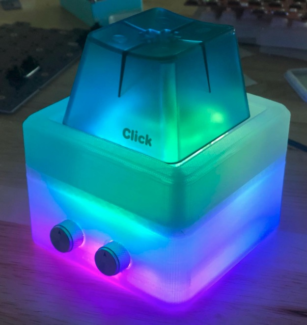

# BAMFK-1 Case Files

Case files for the [BAMFK-1](https://keeb.io/products/bamfk-1-big-switch-pcb).

## STL Files

3D printable STL files have been provided for a three-piece case:

- [Case Top.stl](3D-print/Case%20Top.stl) - Top piece for case (optional)
- [Case Bottom.stl](3D-print/Case%20Bottom.stl) - Bottom piece for case with integrated switch plate
- [Bottom Cover.stl](3D-print/Bottom%20Cover.stl) - Cover that inserts into the bottom of the case to close things up

A version of the bottom case piece that does not have the encoder holes has also been included.

The top piece is screwed in from underneath, so you will need 10 M2 screws for use with it.

It's recommended to print with the top faces of the top and bottom pieces on the print bed.

## Acrylic Case

Files for the [acrylic case](https://keeb.io/products/bamfk-1-acrylic-case-for-big-switch) are not currently available, as they are tweaked based on manufacturer tolerances.

## License
These case files are released under the MIT License.
